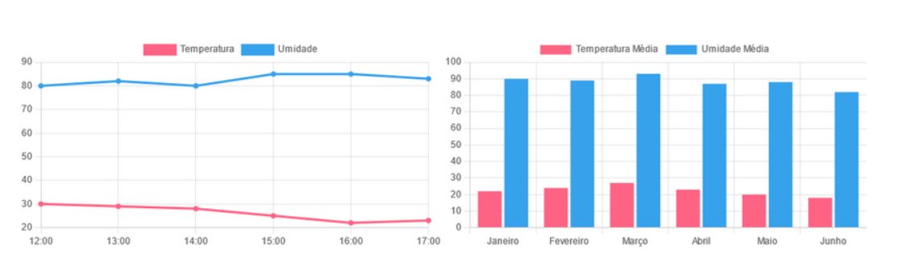
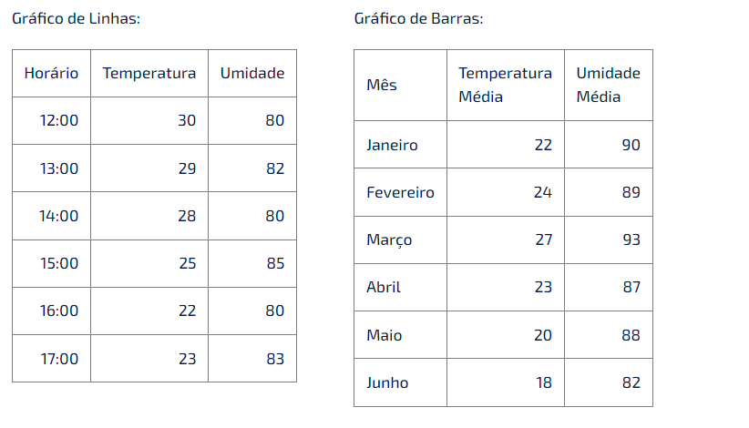

# atividadeChart.JS

<a href="https://youtu.be/6jP_mnWTirk">Após assistir ao vídeo - Material de Apoio - Vídeo - Chart.JS (clique aqui)</a> 
Crie uma página HTML e utilize a biblioteca "Chart.JS" como foi explicado, criando uma dashboard como a imagem abaixo:

Para facilitar, estes são os dados:

